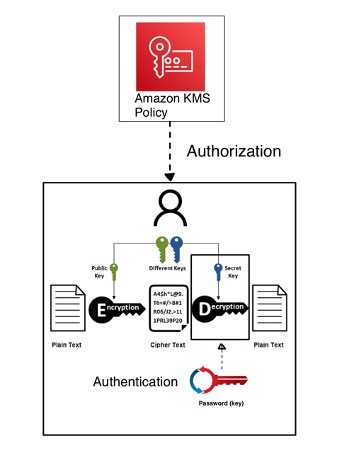

# secure_messages
This project is based on more secure implementation of E2EE messaging.

### Asymmetric Key Encryption

Asymmetric encryption involves two keys: a public key and a private key. The public key is used to encrypt data, and the private key is used to decrypt data. This method ensures that even if the encrypted data is intercepted, it cannot be decrypted without the private key.

1. **Public Key**: This key is shared publicly and can be used by anyone to encrypt data.
2. **Private Key**: This key is kept secret and is used to decrypt data encrypted with the corresponding public key.

### The New Method: An Added Layer of Security

The new method developed utilizes Amazon Key Management Service (KMS) to manage public and private keys. By leveraging Amazon KMS's policy management features, we can authorize users based on specific requirements, enhancing the overall security framework. After proper authorization, as an additional layer of protection is introduced through an extra key, functioning similarly to a symmetric key, the users must enter a password before they access their private key to decrypt the messages. This approach ensures that even if the private key is compromised, the security of the data remains intact.

